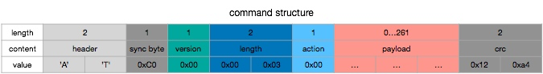

# wb-stm32-ws2812b

## install

flash with jlink

```
make
make flash
```

run demo on pc

```py
pip install pyserial

python3 tools/strandtest.py
```

## debug with jlink

```
JLinkExe -SelectEmuBySN 030000299 -If SWD -Device STM32F030C8 -AutoConnect 1 -RTTTelnetPort 19021 -Speed 10000

JLinkRTTClient -RTTTelnetPort 19021
```

## command

command send to LED board



`action` value:

* 'E' - for command test
* 'R' - for hardware reset
* 'D' - for LED data


